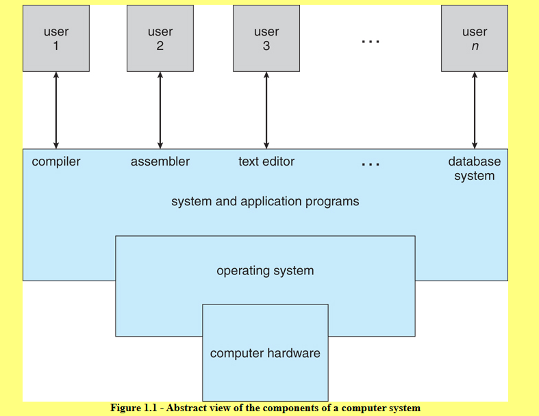
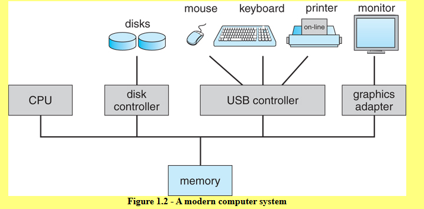
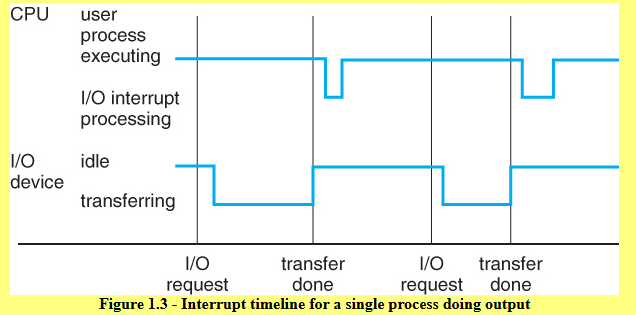

# Chapter 1 - Introduction

## 1.1 What Operating Systems do?

- OS is an interface between hardware and Apps + Users
- OS manages the resources of your computer

## 1.2 Computer System Organisation - What are the parts?

### 1.2.1 Computer System Operation

- Bootstrap program
- Shared memory between CPU and I/O cards
- Time slicing for multi-process operation
- Interrupt Handling
- Implementation of system calls

### 1.2.2 Storage Structure
